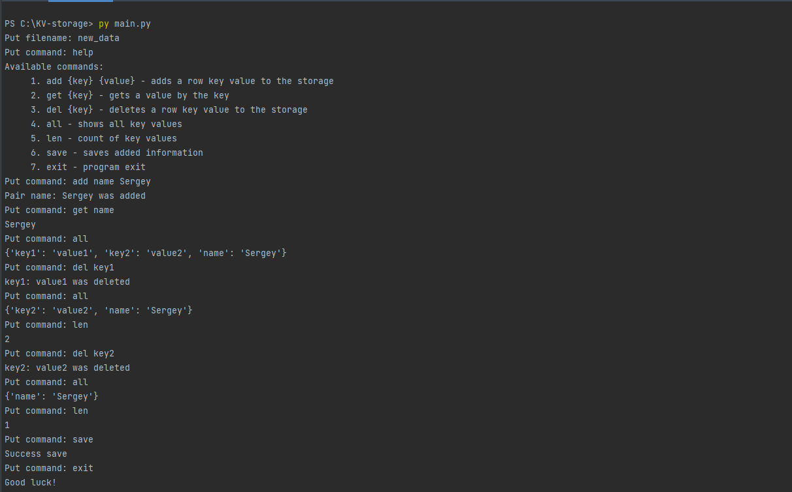

# Task: KV-storage

## Разработчик:
- Сажин Сергей

## Описание
Реализовать хранилище «ключ-значение» с операциями добавления пары ключ/значение и получения (списка) значений

## Запуск
Запуск: `> py main.py`

Отображение справки:   
`> py main.py`  
`Put filename: new_storage`  
`Put command: help`

Пример работы:
