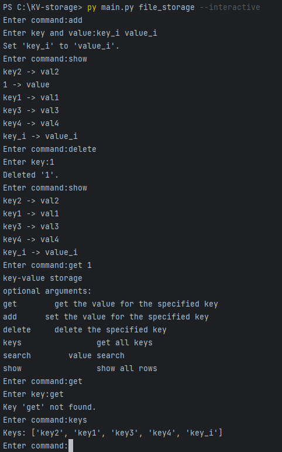

# Task: KV-storage

## Разработчик:
- Сажин Сергей

## Описание
Реализация хранилища «ключ-значение» с операциями добавления пары ключ/значение и получения (списка) значений

## Requirements
* Python >3.9 

## Запуск
Запуск: `> usage: main.py [-h] [--get key] [--add key [value ...]] [--delete key] [--keys] [--search value] [--show] [--interactive] filename
`

### Отображение справки:   
`> py main.py -h`  
### Запуск в интерактивном режиме:   
`> py main.py filename --interactive`  

## Задачи:
- [x] Добавление сразу нескольких пар ключ/значение за один запуск
- [x] Достаточно эффективный алгоритм поиска ключа
- [x] Достаточно эффективный алгоритм хранения данных
- [ ] Хранение данных, не помещающихся в память
- [ ] Обширное тестирование
- [x] Устойчивость к перезапуску [данные в хранилище не теряются]
- [x] Возможность создания нескольких экземпляров хранилищ
- [x] Возможность получения всех ключей
- [x] Поиск по значению
- [x] Удаление элементов

## Пример работы:

## Пример работы с интерактивным режимом:

